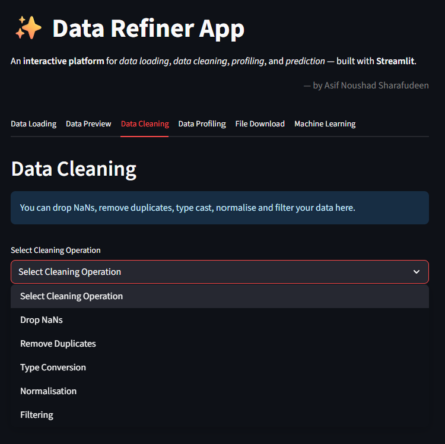

# 📊 Data Refiner App

An interactive **data cleaning, profiling, and prediction platform** built with **Streamlit**.  
We can quickly upload, explore, clean, and run machine learning predictions from a browser-based interface.

---

## 🚀 Features

The app is organized into **multiple tabs**, each serving a specific function:

### **1️⃣ Data Preview**
- Upload **CSV** or **Excel** files.
- View the first few rows of the dataset.
- Automatic data type detection.
- Summary statistics & column insights.
- We use Polars by default for data loading and fall back to Pandas if needed.

### **2️⃣ Data Cleaning**
- Drop **NaN values**.
- Remove **duplicate rows**.
- Change column data types.
- Normalize data (Min-Max Scaling, Z-Score).
- Apply row-based filtering.

### **3️⃣ Data Profiling**
- Generate comprehensive or sample-based data profiles.
- Powered by **YData Profiling**. Provides provision for data profiling using limited rows to improve speed.
- View correlations, missing values, distributions, and warnings.

### **4️⃣ Download & Summary**
- Download the processed dataset as **CSV**
- See summary statistics of the cleaned dataset:
  - Column types

### **5️⃣ ML Prediction Module**
- Choose target and feature columns. The model is presently tested to use 'categorical' target class.
- Train a **Random Forest Classifier** on the uploaded dataset.
- Dataset demonstrated is that of a 'balance scale measurements' obtained from OpenML.
- User can enter custom inputs for instant predictions post training.
- Tested for classification datasets. Regression model can be tested and implemented as 'Rain Forest' is capable of dealing with numerical classes as well. (extendable)

---

## ⚙️ Stack Choices: Pandas vs Polars

This app supports **both Pandas and Polars** for data handling.

| Feature                | **Pandas** | **Polars** |
|------------------------|------------|------------|
| Performance            | Great for small/medium datasets | Optimized for large datasets & parallel processing |
| Memory Usage           | Higher     | Lower (more efficient memory allocation. It allows lazy loading.) |
| Syntax Compatibility   | Widely used, mature ecosystem | Similar to Pandas, growing rapidly |
| File Handling          | Adequate   | Faster CSV/Parquet read-write for big files |
| Multithreading         | Limited    | Built-in parallel execution |

**Why Polars?**
- Handles **large file sizes** efficiently.
- Offers **significant speed improvements** for reading, filtering, and aggregations.
- Uses **lazy evaluation** to optimize query execution.

In this app, for file loading:
- **Default:** Polars (for speed & performance).
- **Optional:** Switch to Pandas when needed.

In this app, for data manipulation:
- **Default:** Pandas (for simplicity & compatibility).
- **Optional:** Switch to Polars for large datasets (e.g., >50MB) for faster performance.

---

## 📊 Machine Learning Model: Random Forest

- Random Forests are **ensemble models**, which uses individual learners and then combines their learning to a single decision. It is often preferred as it is robust and adaptable. But due to cost intensive (High run time for larger data sets) and Black Box nature, it's often not advocated. 

-Black Box: Random Forests does not allow control on what the model does beyond a few hyper-parameters (Eg: Number of trees, depth etc). Thus it's very difficult to say why certain trees performed better while given higher weights.

- Random forest builds multiple **decision trees** and merges them together to get accurate prediction. A large number of uncorrelated trees operate together to outperform individual models. Thus a forest is built with an ensemble of decision trees, usually trained with the "bagging method"

- The data used for training and testing in saved as 'balance_scale.csv'

---

## 🖼️ Screenshots

---

## Data Loading

---

## Data Preview

---

## Data Cleaning

---

## Data Profiling

---

## Data Download & Summary

---

## ML Prediction

---

## 🛠️ Tech Stack

| Technology        | Purpose |
|-------------------|---------|
| **Python 3.10+**  | Core programming |
| **Streamlit**     | Interactive web UI |
| **Pandas / Polars** | Data handling |
| **scikit-learn**  | Machine Learning |
| **ydata-profiling** | Automated profiling |

---

## References:

- Machine Learning Model: Random Forest --> Learning links: 
		
	- https://www.blastanalytics.com/blog/comparing-propensity-modeling-techniques-to-predict-customer-behavior
	- https://swethadhanasekar.medium.com/random-forest-classifier-a-beginners-guide-c0b41713020

- Learning Random Forest Functions, Entropy, Gini Impurity using Microsoft Copilot

- Machine Learning Dataset: https://www.openml.org/search?type=data&sort=runs&id=11&status=active

- Used CHATGPT for learning about the user-interface of streamlit and programming guide

---

##App Hosted (URL):

App hosted live in https://asifnoushad-datarefinerapptool.streamlit.app/
