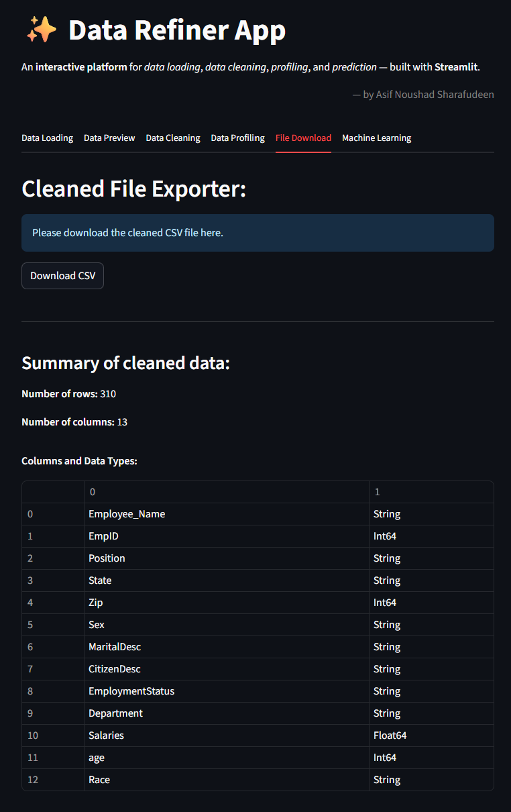

# 📊 Data Refiner App

An interactive **data cleaning, profiling, and prediction platform** built with **Streamlit**.  
We can quickly upload, explore, clean, and run machine learning predictions from a browser-based interface.

---

## 🚀 Features

The app is organized into **multiple tabs**, each serving a specific function:

### **1️⃣ Data Loading**
- Upload **CSV** or **Excel** files.
- Load CSV files via lazy loading feature of pandas and display 5 rows as preview.
- Load entire dataset for further cleaning process.
- We use Polars by default for data loading and fall back to Pandas if needed.

---

  

---

### **2️⃣ Data Preview**
- View the first 100 rows of the dataset. (head() in Pandas/Polars)
- Provides quick snapshot of data structure.
- Ensures correct loading before cleaning.
- Automatically detect the datatypes of the columns selected in the dataset.

---

  

---

### **3️⃣ Data Cleaning**
- Drop **NaN values**: Removes rows with missing data to avoid errors during analysis. (dropna() in Pandas / drop_nulls() in Polars)
- Remove **duplicate rows**: Ensures each record is unique for accurate analysis. (drop_duplicates() in Pandas / unique() in Polars)
- **Type Conversion**: Converts columns to appropriate types (int, float, string) for proper computations. (astype() in Pandas / cast() in Polars)
- **Normalize data**: Rescales numerical features for consistent range. It allows machine learning models to converge faster and avoid bias towards large datasets. 
	- Currently, only numerical values are allowed to be normalised in the app. Text normalisation is not considered.

		- **Min-Max Scaling** : Rescales features to a fixed range. (MinMaxScaler() from scikit-learn)  
		- Equation ==> Normalised Value = (Actual Value - Minimum Value)/(Maximum Value - Minimum Value)  
		- Here, the values lie between 0 and 1.  

	- **Z-Score** : Standardizes features by removing the mean and scaling to unit variance, useful for normally distributed data. (StandardScaler() from scikit-learn)  
		- Equation ==> Normalised Value = (Actual Value - Mean)/Standard Deviation  
		- Here, data centers around mean = 0 and standard deviation = 1.  
		- Values below mean are negative; values above mean are positive.  
		- Dividing by standard deviation makes std dev = 1.  

- Apply row-based filtering: Keep rows based on conditions (e.g., value thresholds). (query() in Pandas / filter() in Polars)

---

  

---

### **4️⃣ Data Profiling**
- Generate comprehensive or sample-based data profiles and integrate it as an html string into streamlit.
- By default loads 1000 random sampled rows to generate profile unless user demands a full profile.
- Powered by **YData Profiling**. (Pandas Profiling).
- View correlations, missing values, distributions, and warnings. Disabled interactions, text profiling, duplicates and certain correlation calculations to improve speed.
- Functions used: ProfileReport() from ydata_profiling

---

  

---

### **5️⃣ Download & Summary**
- Download the processed dataset as **CSV**. (to_csv() in Pandas / write_csv() in Polars)
- See summary statistics of the cleaned dataset: Rows, Columns, Datatypes

--- 

  

---

### **6️⃣ ML Prediction Module**
- Choose target and feature columns. The model is presently tested to use 'categorical' target class.
- Train a **Random Forest Classifier** on the uploaded dataset. (RandomForestClassifier() from scikit-learn)
- Dataset demonstrated is that of a 'balance scale measurements' obtained from OpenML. (filename: balance_scale_train.csv)
- User can test batch data and download predictions csv. (filename: balance_scale_batch_test.csv)
- User can enter custom inputs for instant predictions post training.
- Tested for classification datasets. Regression model can be tested and implemented as 'Rain Forest' is capable of dealing with numerical classes as well. (extendable)
- Other Functions used: fit(), predict(), score()

---

## 📊 Machine Learning Model: Random Forest

- Random Forests are **ensemble models**, which uses individual learners and then combines their learning to a single decision. It is often preferred as it is robust and adaptable. But due to cost intensive (High run time for larger data sets) and Black Box nature, it's often not advocated. 

- **Black Box:** Random Forests does not allow control on what the model does beyond a few hyper-parameters (Eg: Number of trees, depth etc). Thus it's very difficult to say why certain trees performed better while given higher weights.

  

- Random forest builds multiple **decision trees** and merges them together to get accurate prediction. A large number of uncorrelated trees operate together to outperform individual models. Thus a forest is built with an ensemble of decision trees, usually trained with the "bagging method"

- The data used for training and testing is saved as `balance_scale.csv`. Below is the data sample:

  

- During training, the dataset is split into training and test sets (typically 70–80% for training, 20–30% for testing). The Random Forest model learns patterns by building multiple decision trees on random subsets of features and samples, which helps reduce overfitting and improves generalization.

- Each tree predicts the class independently, and the final prediction is made via majority voting across all trees in the forest. This ensemble approach ensures that individual tree errors are minimized.

- Hyperparameters such as the number of trees, maximum tree depth, and minimum samples per leaf are tuned to balance accuracy and computation time.

- Once trained, the model can predict the tipping direction for new scale configurations.

---

  

---

## ⚙️ Stack Choices: Pandas vs Polars

This app supports **both Pandas and Polars** for data handling.

| Feature                | **Pandas** | **Polars** |
|------------------------|------------|------------|
| Performance            | Great for small/medium datasets | Optimized for large datasets & parallel processing |
| Memory Usage           | Higher     | Lower (more efficient memory allocation. It allows lazy loading.) |
| Syntax Compatibility   | Widely used, mature ecosystem | Similar to Pandas, growing rapidly |
| File Handling          | Adequate   | Faster CSV/Parquet read-write for big files |
| Multithreading         | Limited    | Built-in parallel execution |

**Why Polars?**
- Handles **large file sizes** efficiently.
- Offers **significant speed improvements** for reading, filtering, and aggregations.
- Uses **lazy evaluation** to optimize query execution.

**When does it shift to Pandas?**
- Polars only supports UTF-8 encoding. In case of other encodings, it shifts to Pandas.
- Inconsistent data cannot be inferred by Polars using 'infer_schema_length'. Thus, shifts to Pandas.

**In this app:**
- **File loading:** Default = Polars; fallback = Pandas.  
- **Data manipulation:** Default = Pandas; optional = Polars for large datasets (>50MB).

---

## ⚙️ Tips to handle large files (Optimizations):

- **Already Implemented:**
	- Polars for Data Loading  
	- Fallback to Pandas  
	- Lazy Loading for Display  
	- Sample-Based Profiling  
	- Optimized Profiling  

- **Possible Additions:**
	- Caching intermediate results  
	- Chunked Pro
