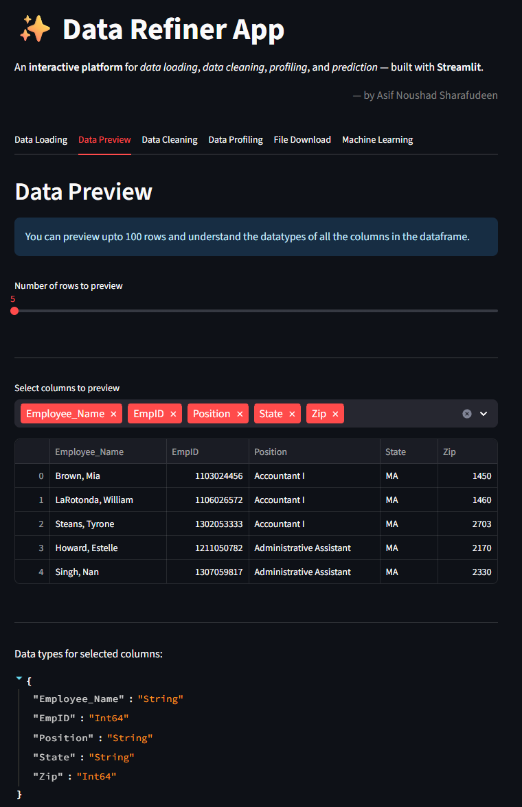

# 📊 Data Refiner App

An interactive **data cleaning, profiling, and prediction platform** built with **Streamlit**.  
We can quickly upload, explore, clean, and run machine learning predictions from a browser-based interface.

---

## 🚀 Features

The app is organized into **multiple tabs**, each serving a specific function:

  
<b>1️⃣ Data Loading & Preview</b>

- Upload **CSV** or **Excel** files.
- Load CSV files via lazy loading feature of pandas and display 5 rows as preview.
- Load entire dataset for further cleaning process.
- We use Polars by default for data loading and fall back to Pandas if needed.
- View the first 100 rows of the dataset. (head() in Pandas/Polars)
- Automatic data type detection. (dtypes in Pandas/Polars)

---

  
<b>2️⃣ Data Cleaning</b>

- Drop **NaN values**: Removes rows with missing data to avoid errors during analysis.
- Remove **duplicate rows**.
- **Type Conversion**: Converts columns to appropriate types.
- **Normalize data**:
  - **Min-Max Scaling**  
    Equation: `(Value - Min)/(Max - Min)`
  - **Z-Score Normalization**  
    Equation: `(Value - Mean)/Std`

- Apply row-based filtering (query/filter).

---

  
<b>3️⃣ Data Profiling</b>

- Generate comprehensive or sample-based data profiles.
- By default loads 1000 random sampled rows.
- Powered by **YData Profiling**.
- Functions used: `ProfileReport()`.

---

  
<b>4️⃣ Download & Summary</b>

- Download the processed dataset as **CSV**.  
- See summary statistics of the cleaned dataset.

---

  
<b>5️⃣ ML Prediction Module</b>

- Choose target and feature columns.
- Train a **Random Forest Classifier**.  
- User can enter custom inputs for predictions.  
- Dataset: Balance scale measurements from OpenML.  

---

## 📊 Machine Learning Model: Random Forest

  
<b>Click to expand Random Forest details</b>

- Random Forests are **ensemble models**, combining multiple decision trees.  
- Advantage: robust, reduces overfitting.  
- Drawback: costly for large datasets & acts as a black box.

- Training dataset: `balance_scale.csv` with left-weight, left-distance, right-weight, right-distance.

- Dataset split into train/test.  
- Predictions based on majority voting across trees.  
- Hyperparameters: n_estimators, max_depth, min_samples_leaf, etc.  

---

## ⚙️ Stack Choices: Pandas vs Polars

  
<b>Click to expand Pandas vs Polars comparison</b>

| Feature                | **Pandas** | **Polars** |
|------------------------|------------|------------|
| Performance            | Great for small/medium datasets | Optimized for large datasets & parallel processing |
| Memory Usage           | Higher     | Lower |
| Syntax Compatibility   | Mature ecosystem | Similar to Pandas, growing rapidly |
| File Handling          | Adequate   | Faster CSV/Parquet read-write |
| Multithreading         | Limited    | Built-in parallel execution |

**Why Polars?**
- Handles **large file sizes** efficiently.
- **Lazy evaluation** optimizes queries.

**When does it shift to Pandas?**
- Non-UTF8 encodings.  
- Inconsistent data schema.  

---

## ⚙️ Tips to handle large files (Optimizations)

  
<b>Click to expand Optimizations</b>

**Already Implemented:**
- Polars default for data loading.  
- Fallback to Pandas if needed.  
- Lazy Loading for Display (first 5 rows).  
- Sample-Based Profiling (1000 rows).  
- Selective profiling to reduce overhead.  

**Possible Additions:**
- Caching.  
- Chunked processing.  
- Vectorized operations.  

---

## 🛠️ Tech Stack

  
<b>Click to expand Tech Stack</b>

| Technology        | Purpose |
|-------------------|---------|
| **Python 3.10+**  | Core programming |
| **Streamlit**     | Interactive web UI |
| **Pandas / Polars** | Data handling |
| **scikit-learn**  | Machine Learning |
| **ydata-profiling** | Automated profiling |

---

## 📚 References

  
<b>Click to expand References</b>

- Random Forest articles:  
  - https://www.blastanalytics.com/blog/comparing-propensity-modeling-techniques-to-predict-customer-behavior  
  - https://swethadhanasekar.medium.com/random-forest-classifier-a-beginners-guide-c0b41713020  

- Dataset: https://www.openml.org/search?type=data&sort=runs&id=11&status=active  

- Used ChatGPT for UI & coding guidance.  

---

## 🌐 App Hosted

App live 👉 [Streamlit Deployment](https://asifnoushad-datarefinerapptool.streamlit.app/)

