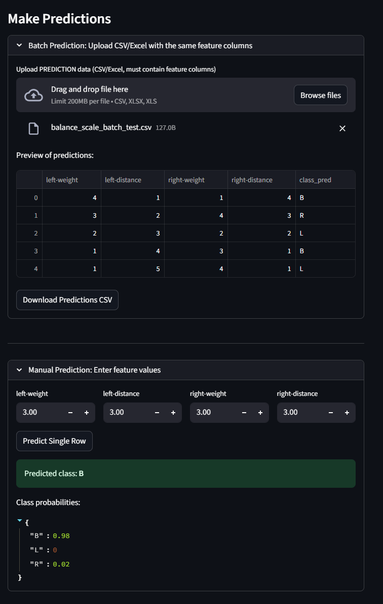

# 📊 Streamlit Data Processing & ML Prediction App

An interactive **data cleaning, profiling, and prediction platform** built with **Streamlit**.  
Ideal for **data analysts**, **data scientists**, and **ML enthusiasts** to quickly upload, explore, clean, and run machine learning predictions — all from a single browser-based interface.

---

## 🚀 Features

The app is organized into **multiple tabs**, each serving a specific function:

### **1️⃣ Data Preview**
- Upload **CSV** or **Excel** files.
- View the first few rows of your dataset.
- Automatic data type detection.
- Summary statistics & column insights.

### **2️⃣ Data Cleaning**
- Drop **NaN values**.
- Remove **duplicate rows**.
- Change column data types.
- Normalize data (Min-Max Scaling, Z-Score).
- Apply row-based filtering.

### **3️⃣ Data Profiling**
- Generate comprehensive or sample-based data profiles.
- Powered by **YData Profiling**.
- View correlations, missing values, distributions, and warnings.

### **4️⃣ ML Prediction Module**
- Choose target and feature columns.
- Train a **Random Forest Classifier** on the uploaded dataset.
- Enter custom inputs for instant predictions.
- Supports both classification & regression datasets (extendable).

### **5️⃣ Download & Summary**
- See summary statistics of the cleaned dataset:
  - Column types
  - Missing value counts
- Download the processed dataset as **CSV** or **Excel**.

---

## ⚙️ Stack Choices: Pandas vs Polars

This app supports **both Pandas and Polars** for data handling.

| Feature                | **Pandas** | **Polars** |
|------------------------|------------|------------|
| Performance            | Great for small/medium datasets | Optimized for large datasets & parallel processing |
| Memory Usage           | Higher     | Lower (more efficient memory allocation) |
| Syntax Compatibility   | Widely used, mature ecosystem | Similar to Pandas, growing rapidly |
| File Handling          | Adequate   | Faster CSV/Parquet read-write for big files |
| Multithreading         | Limited    | Built-in parallel execution |

**Why Polars?**
- Handles **large file sizes** efficiently.
- Offers **significant speed improvements** for reading, filtering, and aggregations.
- Uses **lazy evaluation** to optimize query execution.

In this app, for file loading:
- **Default:** Polars (for speed & performance).
- **Optional:** Switch to Pandas when needed.

In this app, for data manipulation:
- **Default:** Pandas (for simplicity & compatibility).
- **Optional:** Switch to Polars for large datasets (e.g., >50MB) for faster performance.

---

## 🖼️ Screenshots

### Data Loading


### Data Preview


### Data Cleaning


### Data Profiling


### Data Download & Summary


### ML Prediction



---

## 🛠️ Tech Stack

| Technology        | Purpose |
|-------------------|---------|
| **Python 3.10+**  | Core programming |
| **Streamlit**     | Interactive web UI |
| **Pandas / Polars** | Data handling |
| **scikit-learn**  | Machine Learning |
| **ydata-profiling** | Automated profiling |

---

## 📥 Installation

```bash
# Clone the repository
git clone https://github.com/<your-username>/<repo-name>.git
cd <repo-name>

# Install dependencies
pip install -r requirements.txt

# Run the app
streamlit run app.py
